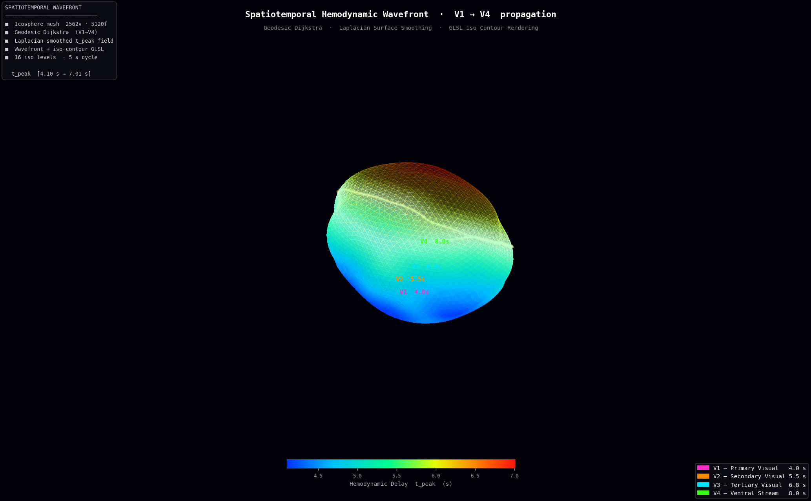

# Brain Network Visualizer

A web-based 3D brain functional connectivity visualization pipeline for fMRI-derived BOLD signal data, targeting SIGGRAPH 2026 Student Research Competition.

## Results

### Idea B · Spatiotemporal Hemodynamic Wavefront



_Geodesic Dijkstra propagation of $t_{peak}$ on a 2562-vertex icosphere mesh (Laplacian-smoothed). Blue (V1, ~4.1 s) → red (V4, ~7.0 s). The glowing white band is the animated wavefront; white grid lines are iso-contour rings at every 0.38 s interval.\_

---

## Overview

This project addresses the **visual clutter problem** that arises when rendering large-scale fMRI-derived brain networks in 3D space. Rather than simply mapping medical data, it proposes a graphics-optimized pipeline that compresses high-dimensional 4D fMRI data using the **Spatiotemporal Hemodynamic Wavefront** technique, enabling intuitive, real-time visualization at 60 fps in a web browser.

## Features

- **Spatiotemporal hemodynamic wavefront** — maps $t_{peak}$ (hemodynamic arrival time) across the visual hierarchy V1 → V4 onto a 3D brain mesh as an animated wavefront with iso-contour rings. Computed via multi-source geodesic Dijkstra on the mesh graph, then Laplacian-smoothed; rendered in a single GLSL pass.
- **Backend–Frontend decoupled architecture** — heavy computation (geodesic mapping, Laplacian smoothing) runs offline in Python; only pre-computed geometry and per-vertex attributes are exported to JSON and streamed to the browser.

## Tech Stack

| Layer    | Technologies                                      |
| -------- | ------------------------------------------------- |
| Backend  | Python · `numpy` · `matplotlib`                   |
| Bridge   | JSON                                              |
| Frontend | React · React Three Fiber · Three.js · WebGL/GLSL |
| Bundler  | Vite                                              |

## Project Structure

```
.
├── prd.md                     # Product Requirements Document
├── generate_wavefront.py      # Backend: icosphere mesh + geodesic t_peak → wavefront_data.json
├── render_wavefront_png.py    # Static PNG renderer (matplotlib) for result figures
├── resultviewer.png           # Result figure — Spatiotemporal Wavefront
└── brain-viewer/              # Main Vite + React application
    ├── index.html
    ├── package.json
    ├── vite.config.js
    ├── public/
    │   └── wavefront_data.json    # Wavefront mesh + t_peak served to browser
    └── src/
        ├── main.jsx
        ├── App.jsx
        └── WavefrontViewer.jsx    # Spatiotemporal wavefront viewer
```

## Getting Started

### Prerequisites

- Node.js ≥ 18
- Python ≥ 3.9 with `numpy` and `matplotlib` installed

```bash
pip install numpy matplotlib
```

### 1. Generate wavefront data (offline)

```bash
python generate_wavefront.py
```

Builds an icosphere brain mesh, runs multi-source geodesic Dijkstra for t_peak propagation, applies Laplacian smoothing, and exports `brain-viewer/public/wavefront_data.json`.

### 2. Install dependencies and run the dev server

```bash
cd brain-viewer
npm install
npm run dev
```

Open `http://localhost:5173` in your browser.

### 3. (Optional) Render result PNG

```bash
python render_wavefront_png.py
```

Generates `resultviewer.png` — a static high-quality render of the wavefront visualization.

---

## Wavefront Algorithm Details (`generate_wavefront.py`)

### Mesh Generation

An icosphere with 4 subdivision levels produces **2,562 vertices and 5,120 faces**. The unit sphere is then deformed into a brain-like ellipsoid:

1. **Anisotropic scaling** — wider laterally (×1.40), elongated anterior-posteriorly (×1.20)
2. **Ventral flattening** — vertices below the equator are compressed (×0.70 in Y)
3. **Occipital bulge** — posterior vertices scaled ×1.10
4. **Subtle gyri** — 5 low-frequency sinusoidal modes (amplitude 0.01–0.02 r.u.) displaced along unit normals

### Geodesic Dijkstra Propagation

Each visual area seed is assigned its empirical $t_{peak}$:

| Region | $t_{peak}$ | Location                    |
| ------ | ---------- | --------------------------- |
| V1     | 4.0 s      | Posterior occipital pole    |
| V2     | 5.5 s      | Surrounding V1              |
| V3     | 6.8 s      | Parieto-occipital sulcus    |
| V4     | 8.0 s      | Lateral occipital / ventral |

Multi-source Dijkstra propagates from all seed vertices simultaneously on the mesh graph, using Euclidean edge lengths as propagation costs. This produces a smooth $t_{peak}$ field where value $= t_{seed} + \text{geodesic distance}$.

### Laplacian Smoothing of the Scalar Field

The raw Dijkstra field has sharp transitions at region boundaries. Five iterations of 1-ring Laplacian smoothing ($\lambda = 0.6$) remove these artefacts while preserving the large-scale gradient:

$$t'_i = (1 - \lambda)\, t_i + \lambda \cdot \frac{1}{|N_i|}\sum_{j \in N_i} t_j$$

### GLSL Wavefront Shader

The fragment shader implements four layered effects in a single pass:

1. **Reveal mask** — `smoothstep` fades in the colour map for vertices already reached by the wavefront
2. **Glow band** — Gaussian $\exp\!\left(-\frac{(t_{peak} - t_{wf})^2}{2\sigma^2}\right)$ centred on the current wavefront position
3. **Iso-contour rings** — `mod(t_{peak}, \Delta t)` produces equidistant rings; only rendered behind the wavefront
4. **Fresnel rim** — edge brightening via $\left(1 - |\hat{n} \cdot \hat{v}|\right)^{2.5}$

The `u_wavefront` uniform sweeps from $t_{min}$ to $t_{max}$ over a 5-second cycle, driven by `clock.getElapsedTime()` in `useFrame`.

---

## Known Limitations & Future Work

| Area       | Current state                | Improvement path                         |
| ---------- | ---------------------------- | ---------------------------------------- |
| Mesh       | Synthetic icosphere          | Replace with FreeSurfer cortical surface |
| Seed ROIs  | Hard-coded ellipsoid regions | Map to MNI atlas V1–V4 coordinates       |
| Dynamic FC | Static $t_{peak}$            | Animate HRF parameters over time         |

## Research Context

Brain functional connectivity is analyzed from fMRI BOLD signals using Multiscale Entropy (MSE) and ANCOVA to study aging and neurological disease. This visualization pipeline makes those findings accessible and explorable directly in the browser, without requiring specialized software installation.

## License

MIT
